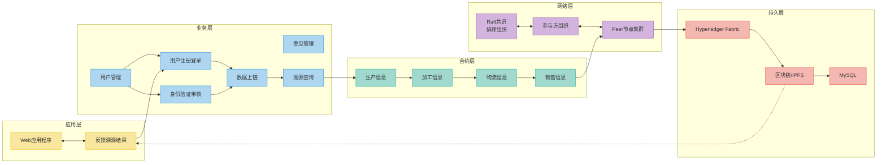

```mermaid
flowchart LR
    %% 定义节点样式
    classDef appLayer fill:#F9E79F,stroke:#F1C40F;
    classDef bizLayer fill:#AED6F1,stroke:#3498DB;
    classDef contractLayer fill:#A2D9CE,stroke:#1ABC9C;
    classDef networkLayer fill:#D2B4DE,stroke:#9B59B6;
    classDef persistLayer fill:#F5B7B1,stroke:#E74C3C;

    subgraph 应用层
        A[Web应用程序]:::appLayer
        B[基于区块链的\n海鲜溯源系统]:::appLayer
        A <--> B
    end

    subgraph 业务层
        C[用户注册登录]:::bizLayer
        D[身份验证审核]:::bizLayer
        E[数据上链]:::bizLayer
        F[用户管理]:::bizLayer
        G[意见管理]:::bizLayer
        H[溯源查询]:::bizLayer
        C --> E
        D --> E
        E --> H
        F --> C
        F --> D
    end

    subgraph 合约层
        I[生产信息]:::contractLayer
        J[加工信息]:::contractLayer
        K[物流信息]:::contractLayer
        L[销售信息]:::contractLayer
        I --> J --> K --> L
    end

    subgraph 网络层
        M[Raft共识\n排序组织]:::networkLayer
        N[参与方组织]:::networkLayer
        O[Peer节点集群]:::networkLayer
        M <--> N <--> O
    end

    subgraph 持久层
        P[Hyperledger Fabric]:::persistLayer
        Q[区块链/IPFS]:::persistLayer
        R[MySQL]:::persistLayer
        P --> Q
        Q --> R
    end

    %% 跨层数据流
    B --> C
    H --> I
    L --> O
    O --> P
    Q -.-> B[反馈溯源结果]
```