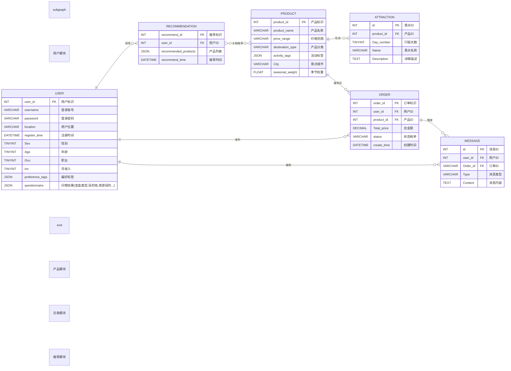

```mermaid
erDiagram
    %% 主布局方向调整为横向
    direction LR
    
    %% ========== 用户模块 ==========
    subgraph 用户模块
    USER {
        INT user_id PK "用户标识"
        VARCHAR username "登录账号"
        VARCHAR password "登录密码"
        VARCHAR location "用户位置"
        DATETIME register_time "注册时间"
        TINYINT Sex "性别"
        TINYINT Age "年龄"
        TINYINT Ocu "职业"
        TINYINT Inc "月收入"
        JSON preference_tags "偏好标签"
        JSON questionnaire "问卷结果{盲盒类型,目的地,旅游目的...}"
    }
    end
    
    %% ========== 产品模块 ==========
    subgraph 产品模块
    PRODUCT {
        INT product_id PK "产品标识"
        VARCHAR product_name "产品名称"
        VARCHAR price_range "价格范围"
        VARCHAR destination_type "产品分类"
        JSON activity_tags "活动标签"
        VARCHAR City "景点城市"
        FLOAT seasonal_weight "季节权重"
    }
    
    ATTRACTION {
        INT id PK "景点ID"
        INT product_id FK "产品ID"
        TINYINT Day_number "行程天数"
        VARCHAR Name "景点名称"
        TEXT Description "详细描述"
    }
    end
    
    %% ========== 交易模块 ==========
    subgraph 交易模块
    ORDER {
        INT order_id PK "订单标识"
        INT user_id FK "用户ID"
        INT product_id FK "产品ID"
        DECIMAL Total_price "总金额"
        VARCHAR status "状态枚举"
        DATETIME create_time "创建时间"
    }
    
    MESSAGE {
        INT id PK "消息ID"
        INT user_id FK "用户ID"
        VARCHAR Order_id FK "订单ID"
        VARCHAR Type "消息类型"
        TEXT Content "消息内容"
    }
    end
    
    %% ========== 推荐模块 ==========
    subgraph 推荐模块
    RECOMMENDATION {
        INT recommend_id PK "推荐标识"
        INT user_id FK "用户ID"
        JSON recommended_products "产品列表"
        DATETIME recommend_time "推荐时间"
    }
    end
    
    %% ========== 关系定义 ==========
    USER ||--o{ ORDER : "发布"
    USER ||--o{ RECOMMENDATION : "获得"
    USER ||--o{ MESSAGE : "接收"
    
    PRODUCT ||--o{ ATTRACTION : "包含"
    PRODUCT ||--o{ ORDER : "被购买"
    
    ORDER ||--o{ MESSAGE : "触发"
    
    RECOMMENDATION }o..o{ PRODUCT : "关联推荐" 
```