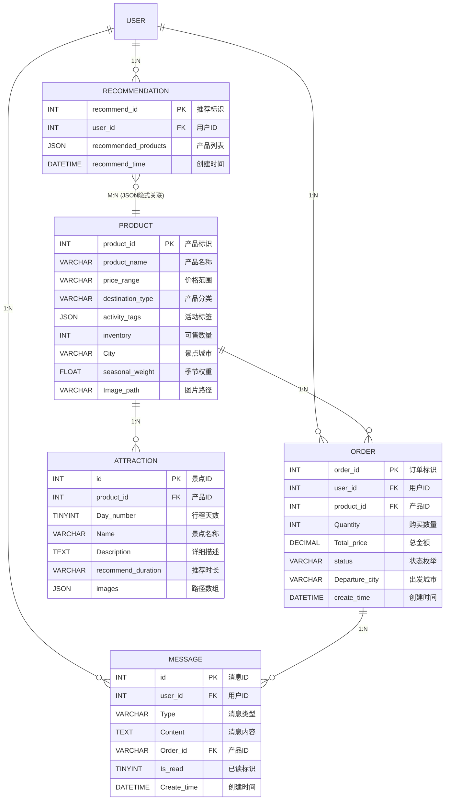

```mermaid
erDiagram
    USER ||--o{ ORDER : "1:N"
    USER ||--o{ RECOMMENDATION : "1:N"
    USER ||--o{ MESSAGE : "1:N"
    PRODUCT ||--o{ ATTRACTION : "1:N"
    PRODUCT ||--o{ ORDER : "1:N"
    ORDER ||--o{ MESSAGE : "1:N"
    RECOMMENDATION }o--|| PRODUCT : "M:N (JSON隐式关联)"

    PRODUCT {
        INT product_id PK "产品标识"
        VARCHAR product_name "产品名称"
        VARCHAR price_range "价格范围"
        VARCHAR destination_type "产品分类"
        JSON activity_tags "活动标签"
        INT inventory "可售数量"
        VARCHAR City "景点城市"
        FLOAT seasonal_weight "季节权重"
        VARCHAR Image_path "图片路径"
    }

    
    ORDER {
        INT order_id PK "订单标识"
        INT user_id FK "用户ID"
        INT product_id FK "产品ID"
        INT Quantity "购买数量"
        DECIMAL Total_price "总金额"
        VARCHAR status "状态枚举"
        VARCHAR Departure_city "出发城市"
        DATETIME create_time "创建时间"
    }

    RECOMMENDATION {
        INT recommend_id PK "推荐标识"
        INT user_id FK "用户ID"
        JSON recommended_products "产品列表"
        DATETIME recommend_time "创建时间"
    }

    ATTRACTION {
        INT id PK "景点ID"
        INT product_id FK "产品ID"
        TINYINT Day_number "行程天数"
        VARCHAR Name "景点名称"
        TEXT Description "详细描述"
        VARCHAR recommend_duration "推荐时长"
        JSON images "路径数组"
    }

    MESSAGE {
        INT id PK "消息ID"
        INT user_id FK "用户ID"
        VARCHAR Type "消息类型"
        TEXT Content "消息内容"
        VARCHAR Order_id FK "产品ID"
        TINYINT Is_read "已读标识"
        DATETIME Create_time "创建时间"
    }    
```