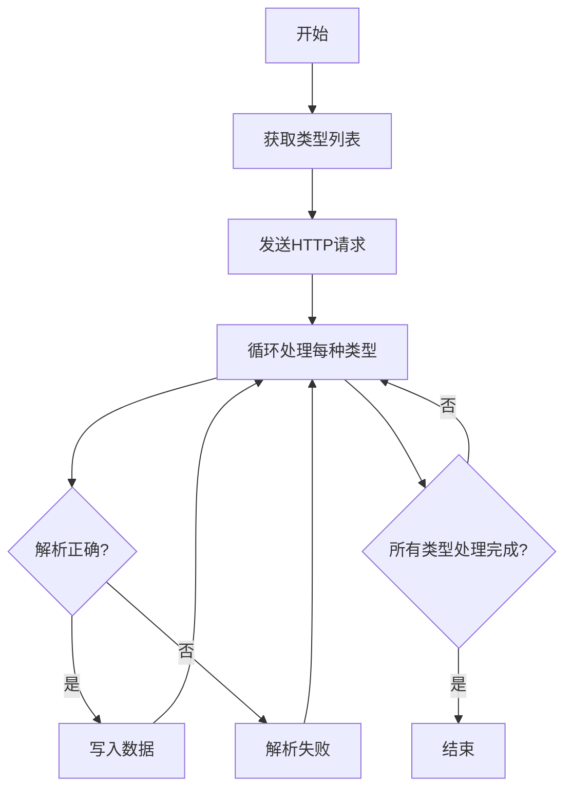

```mermaid
flowchart TD
    A[开始] --> B[获取类型列表]
    B --> C[发送HTTP请求]
    C --> D[循环处理每种类型]
    D --> E{解析正确?}
    E -->|是| F[写入数据]
    E -->|否| G[解析失败]
    F --> D
    G --> D
    D --> H{所有类型处理完成?}
    H -->|否| D
    H -->|是| I[结束]
```