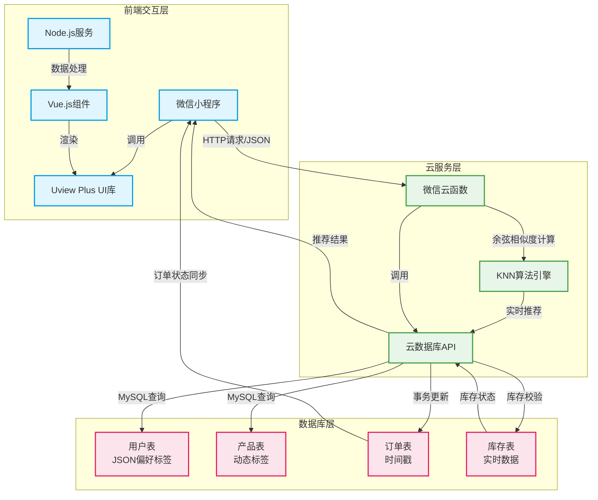

```mermaid
%% 基于KNN的旅游盲盒系统架构图
graph TD
    %% 节点样式定义
    classDef frontend fill:#e1f5fe,stroke:#039be5,stroke-width:2px;
    classDef cloud fill:#e8f5e9,stroke:#43a047,stroke-width:2px;
    classDef database fill:#fce4ec,stroke:#e91e63,stroke-width:2px;
    classDef dataflow stroke:#ff9800,stroke-width:3px,stroke-dasharray:5 5;

    %% 前端交互层
    subgraph 前端交互层
        A[微信小程序]:::frontend
        B[Node.js服务]:::frontend
        C[Vue.js组件]:::frontend
        D[Uview Plus UI库]:::frontend
    end

    %% 云服务层
    subgraph 云服务层
        E[微信云函数]:::cloud
        F[KNN算法引擎]:::cloud
        G[云数据库API]:::cloud
    end

    %% 数据库层
    subgraph 数据库层
        H[用户表\nJSON偏好标签]:::database
        I[产品表\n动态标签]:::database
        J[订单表\n时间戳]:::database
        K[库存表\n实时数据]:::database
    end

    %% 数据流向
    A -- HTTP请求/JSON --> E
    E -- 余弦相似度计算 --> F
    F -- 实时推荐 --> G
    G -- MySQL查询 --> H
    G -- MySQL查询 --> I
    G -- 事务更新 --> J
    G -- 库存校验 --> K
    K -- 库存状态 --> G
    G -- 推荐结果 --> A
    J -- 订单状态同步 --> A

    %% 组件关联关系
    A -- 调用 --> D
    B -- 数据处理 --> C
    C -- 渲染 --> D
    E -- 调用 --> G
```