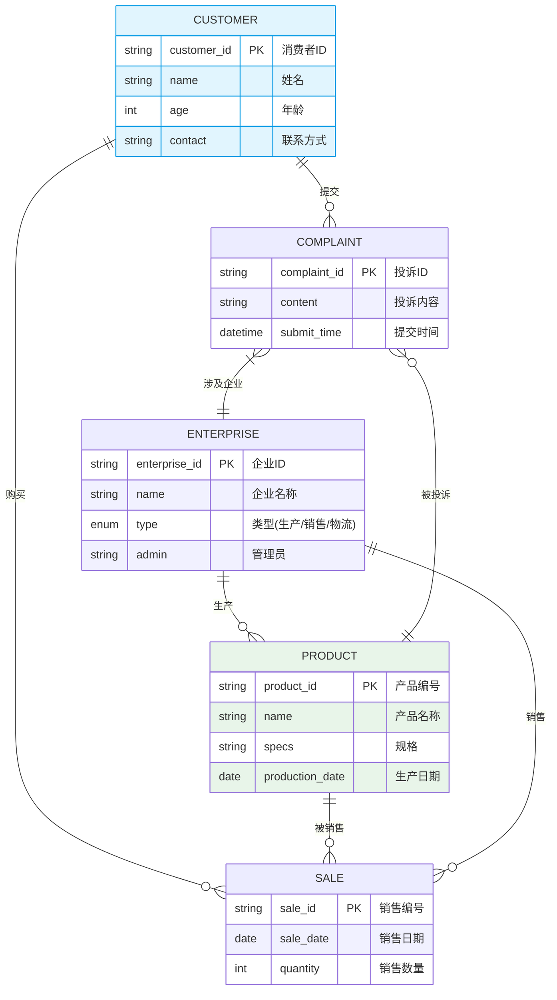

```mermaid
erDiagram
    %% ========== 核心实体 ==========
    CUSTOMER {
        string customer_id PK "消费者ID"
        string name "姓名"
        int age "年龄"
        string contact "联系方式"
    }

    PRODUCT {
        string product_id PK "产品编号"
        string name "产品名称"
        string specs "规格"
        date production_date "生产日期"
    }

    ENTERPRISE {
        string enterprise_id PK "企业ID"
        string name "企业名称"
        enum type "类型(生产/销售/物流)"
        string admin "管理员"
    }

    COMPLAINT {
        string complaint_id PK "投诉ID"
        string content "投诉内容"
        datetime submit_time "提交时间"
    }

    SALE {
        string sale_id PK "销售编号"
        date sale_date "销售日期"
        int quantity "销售数量"
    }

    %% ========== 关系定义 ==========
    CUSTOMER ||--o{ COMPLAINT : "提交"
    CUSTOMER ||--o{ SALE : "购买"

    PRODUCT ||--o{ COMPLAINT : "被投诉"
    PRODUCT ||--o{ SALE : "被销售"

    ENTERPRISE ||--o{ PRODUCT : "生产"
    ENTERPRISE ||--o{ SALE : "销售"

    COMPLAINT }|--|| ENTERPRISE : "涉及企业"

    %% ========== 样式优化 ==========
    style CUSTOMER fill:#E1F5FE,stroke:#039BE5
    style PRODUCT fill:#E8F5E9,stroke#43A047
    style ENTERPRISE fill#FFF3E0,stroke#FB8C00
    style COMPLAINT fill#FCE4EC,stroke#F06292
    style SALE fill#EDE7F6,stroke#7E57C2
```