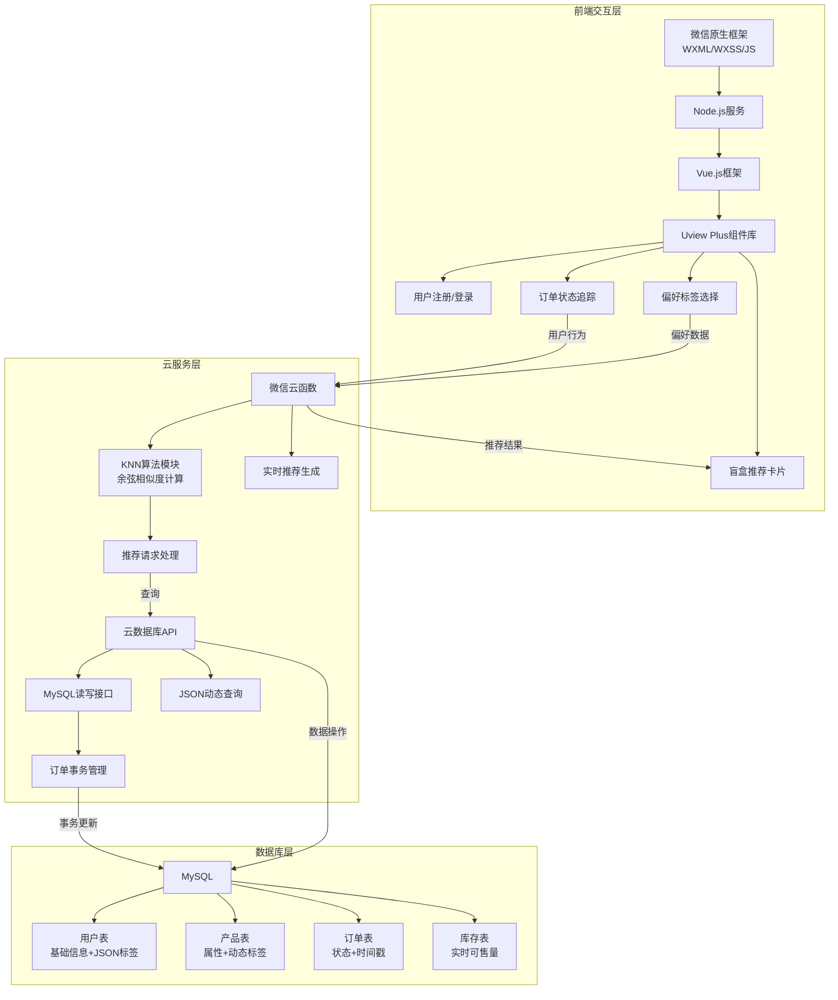

```mermaid
flowchart TD
    subgraph 前端交互层
        A[微信原生框架\nWXML/WXSS/JS] --> B[Node.js服务]
        B --> C[Vue.js框架]
        C --> D[Uview Plus组件库]
        D --> E[用户注册/登录]
        D --> F[偏好标签选择]
        D --> G[盲盒推荐卡片]
        D --> H[订单状态追踪]
    end

    subgraph 云服务层
        I[微信云函数] --> J[KNN算法模块\n余弦相似度计算]
        I --> K[实时推荐生成]
        L[云数据库API] --> M[MySQL读写接口]
        L --> N[JSON动态查询]
        J --> O[推荐请求处理]
        M --> P[订单事务管理]
    end

    subgraph 数据库层
        Q[MySQL] --> R[用户表\n基础信息+JSON标签]
        Q --> S[产品表\n属性+动态标签]
        Q --> T[订单表\n状态+时间戳]
        Q --> U[库存表\n实时可售量]
    end

    %% 数据流向
    H -->|用户行为| I
    F -->|偏好数据| I
    I -->|推荐结果| G
    O -->|查询| L
    P -->|事务更新| Q
    L -->|数据操作| Q
```