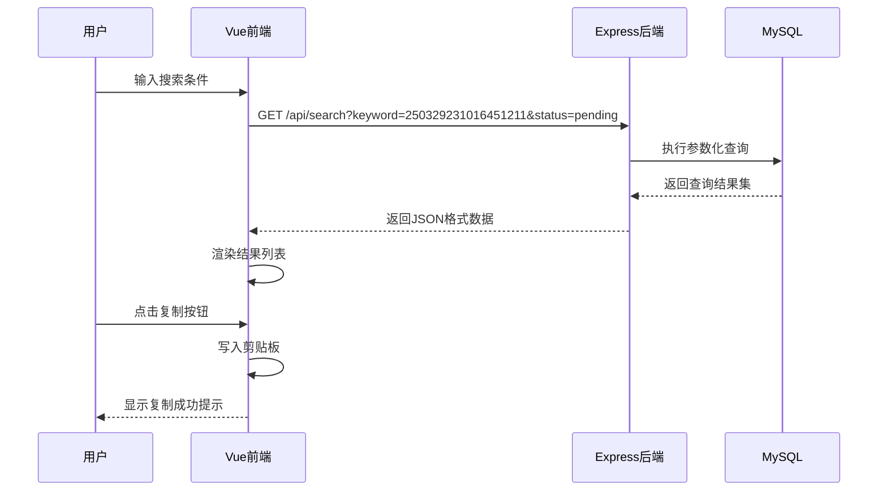

```mermaid
sequenceDiagram
    participant 用户 as 用户
    participant 前端 as Vue前端
    participant 后端 as Express后端
    participant 数据库 as MySQL

    用户->>前端: 输入搜索条件
    前端->>后端: GET /api/search?keyword=250329231016451211&status=pending
    后端->>数据库: 执行参数化查询
    数据库-->>后端: 返回查询结果集
    后端-->>前端: 返回JSON格式数据
    前端->>前端: 渲染结果列表
    用户->>前端: 点击复制按钮
    前端->>前端: 写入剪贴板
    前端-->>用户: 显示复制成功提示 
```