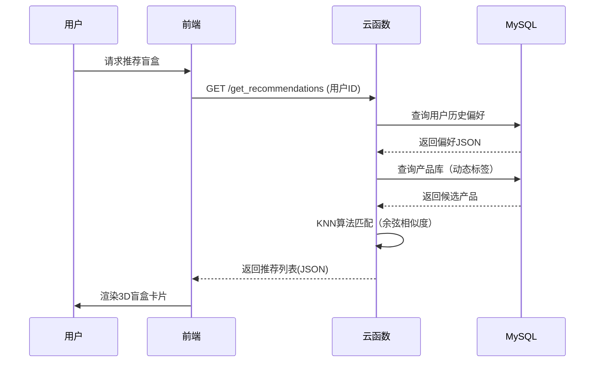

```mermaid
sequenceDiagram
    participant 用户
    participant 前端
    participant 云函数
    participant MySQL

    用户->>前端: 请求推荐盲盒
    前端->>云函数: GET /get_recommendations (用户ID)
    云函数->>MySQL: 查询用户历史偏好
    MySQL-->>云函数: 返回偏好JSON
    云函数->>MySQL: 查询产品库（动态标签）
    MySQL-->>云函数: 返回候选产品
    云函数->>云函数: KNN算法匹配（余弦相似度）
    云函数-->>前端: 返回推荐列表(JSON)
    前端->>用户: 渲染3D盲盒卡片 
```